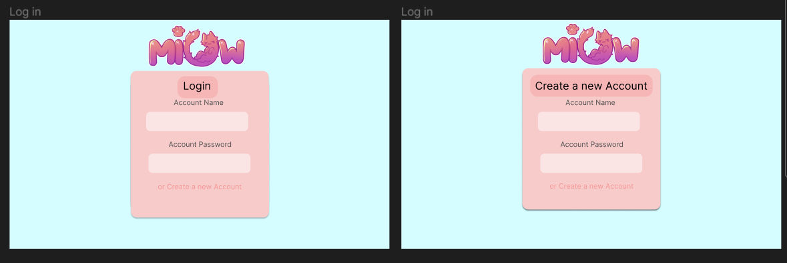
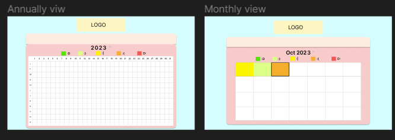
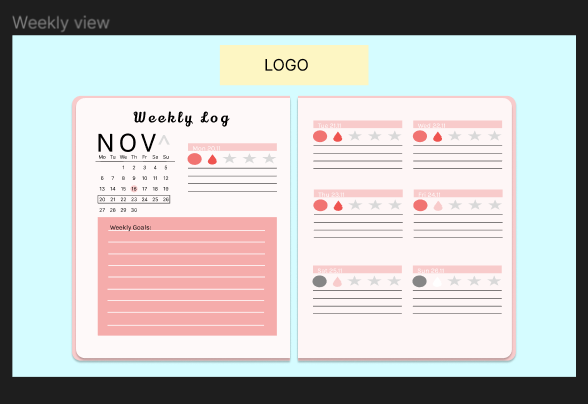
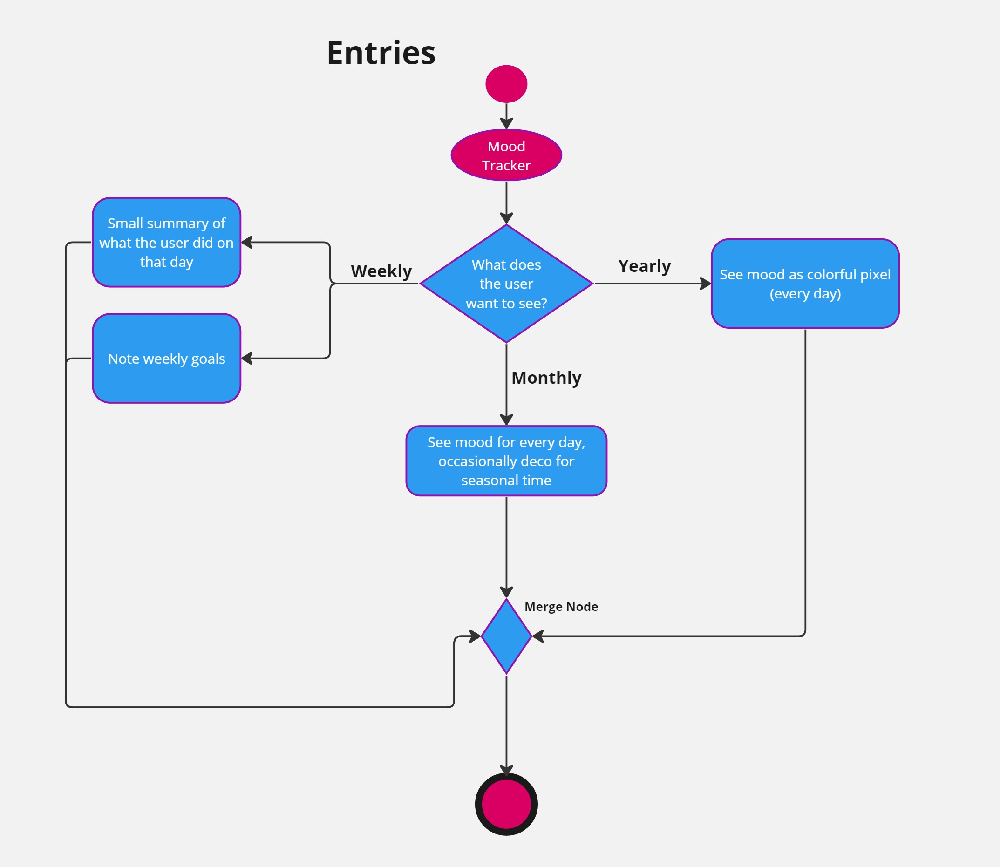
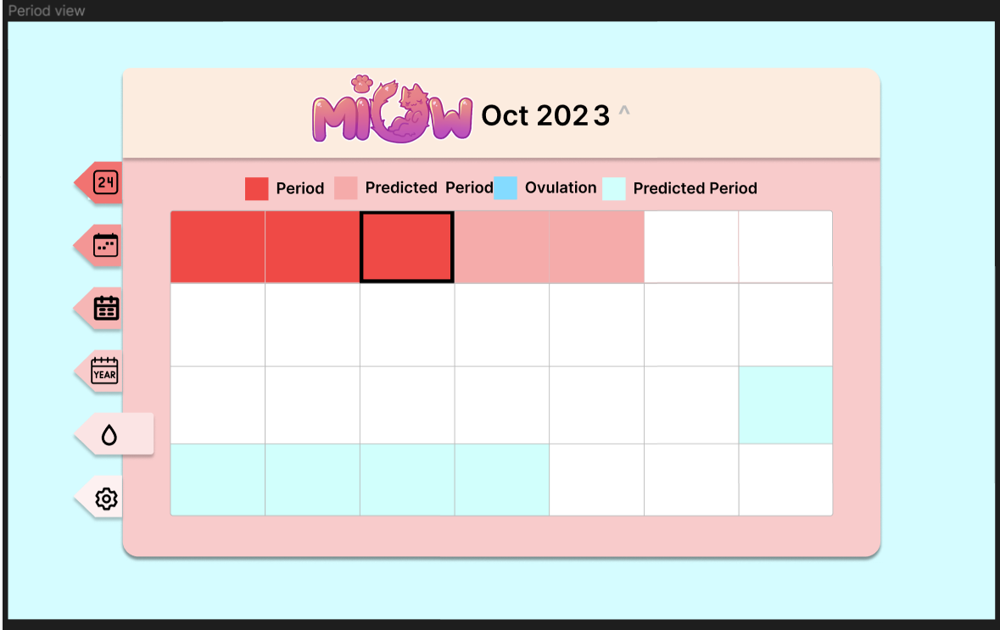
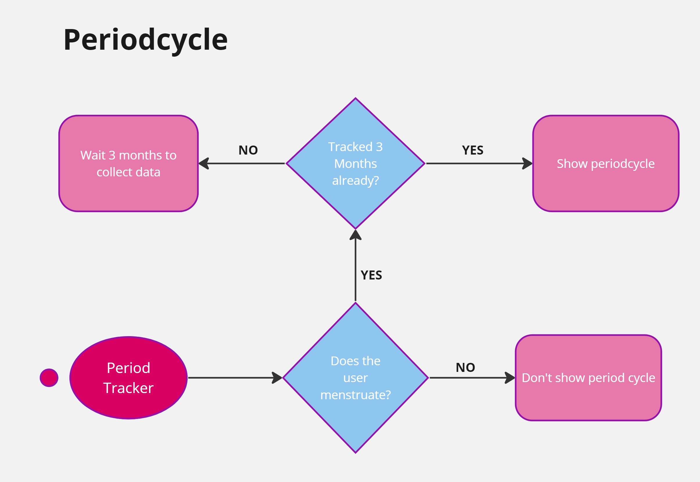
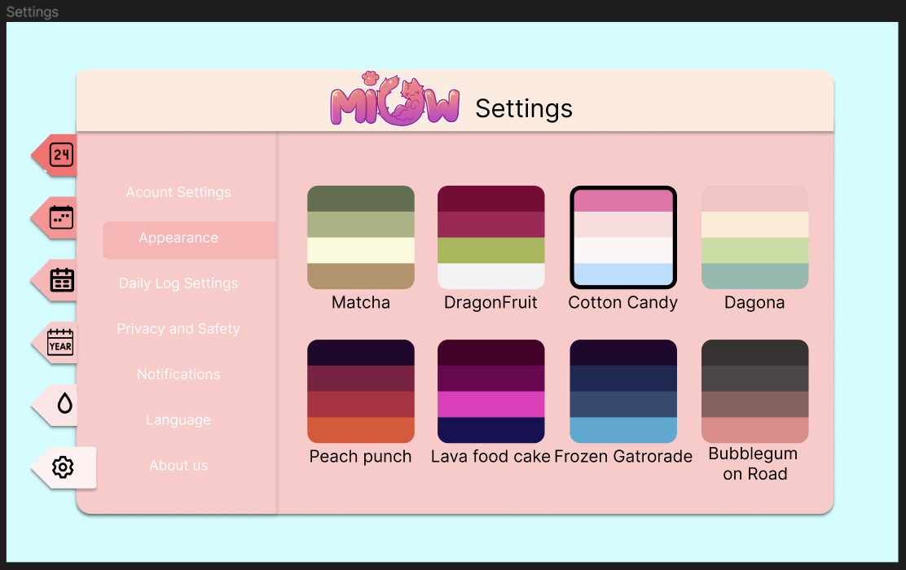
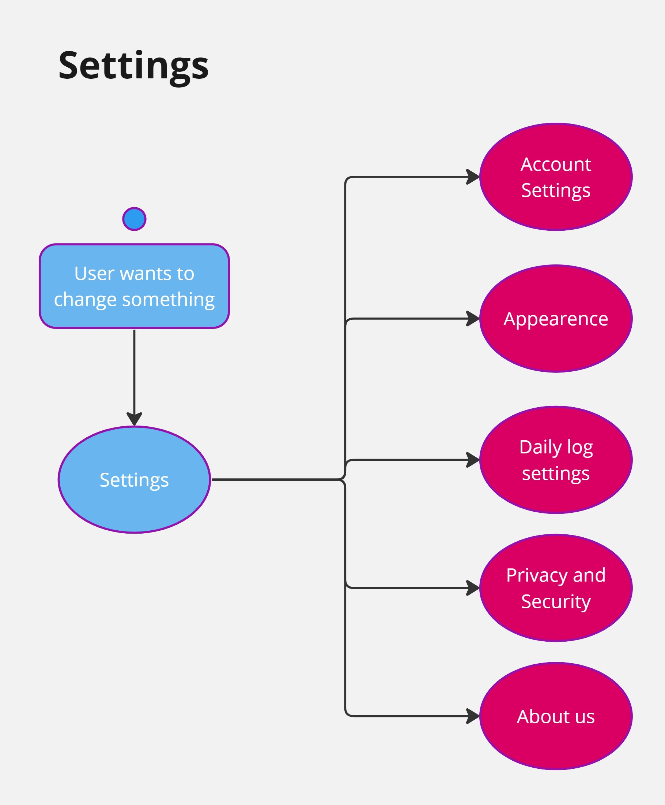

# Pflichtenheft MIOW 

## Inhaltsverzeichnis
- [Pflichtenheft MIOW](#pflichtenheft-miow)
  - [Inhaltsverzeichnis](#inhaltsverzeichnis)
  - [1. Ausgangslage](#1-ausgangslage)
    - [1.1. Ist-Situation](#11-ist-situation)
    - [1.2. Verbesserungspotenziale](#12-verbesserungspotenziale)
  - [2. Zielsetzung](#2-zielsetzung)
  - [3. Funktionale Anforderungen](#3-funktionale-anforderungen)
    - [3.1. Use Case Überblick](#31-use-case-überblick)
    - [3.2 Use Case A - Login](#32-use-case-a---login)
      - [3.2.1 GUI-Design](#321-gui-design)
      - [3.2.2 Workflow](#322-workflow)
    - [3.3 Use Case B - Tägliche einträge](#33-use-case-b---tägliche-einträge)
      - [3.3.1 GUI-Design](#331-gui-design)
      - [3.3.2 Workflow](#332-workflow)
    - [3.4 Use Case C - Auswerten der Einträge](#34-use-case-c---auswerten-der-einträge)
      - [3.4.1 GUI -Design](#341-gui--design)
      - [3.4.2 Workflow](#342-workflow)
    - [3.5 Use Case D - Vorhersagen der Periode](#35-use-case-d---vorhersagen-der-periode)
      - [3.5.1 GUI Design](#351-gui-design)
      - [3.5.2 Workflow](#352-workflow)
    - [3.6  Use Case E - Settings](#36--use-case-e---settings)
      - [3.6.1 GUI-Design](#361-gui-design)
      - [3.6.2 Workflow](#362-workflow)
  - [4. Nicht-funktionale Anforderungen](#4-nicht-funktionale-anforderungen)
    - [`Usability`: Benutzbarkeitsanforderung](#usability-benutzbarkeitsanforderung)
    - [`Efficiency`: Effizienzanforderung](#efficiency-effizienzanforderung)
    - [`Maintenance`: Wartbarkeits- und Portierbarkeitsanforderung](#maintenance-wartbarkeits--und-portierbarkeitsanforderung)
    - [`Security`: Sicherheitsanforderung](#security-sicherheitsanforderung)
    - [`Legal`: Gesetzliche Anforderung](#legal-gesetzliche-anforderung)
  - [5. Mengengerüst](#5-mengengerüst)
  - [6. Systemarchitektur](#6-systemarchitektur)
    - [6.1 Deployment-Diagramm](#61-deployment-diagramm)
    - [6.2 Datenmodell](#62-datenmodell)

## 1. Ausgangslage

### 1.1. Ist-Situation

Die heutige Gesellschaft wird von einer rasanten Lebensweise geprägt, weswegen viele Mitmenschen mit ihren Gedanken, Gefühlen und Erlebnissen überfordert sind und diese auch irgendwo sicher aufschreiben wollen. Journaling ist ein riesen Trend geworden, jedoch alle Ereignisse nur mit Stift und Papier aufzuzeichnen ist für viele herausfordernd. Es gibt noch kein Online tool, womit man einfach, effizient und ohne großen Aufwand sein Leben dokumentieren kann, außerdem bieten vorhandene Tools keine Möglichkeit diese schön und ästhetisch zu gestalten. Weiters braucht man viele verschiedene Applikationen, Kalender und Notitzblöcke um wichtige Termine und Ereignisse zu dokumentieren. Ein gutes Beispiel wäre ein Periodentracker, den viele Frauen heutzutage brauchen/verwenden, da der standard Kalender diese Funktion nicht besitzt.

### 1.2. Verbesserungspotenziale

Es besteht Bedarf an einem Online-Tool, das nicht nur die Funktion des Dokumentierens erfüllt, sondern auch ästhetische Möglichkeiten bietet, um die persönlichen Aufzeichnungen ansprechend zu gestalten. Ein All-in-One-Tool könnte beispielsweise einen Periodentracker sowie andere spezifische Funktionen integrieren, um den Anforderungen der Nutzer gerecht zu werden.

## 2. Zielsetzung

Unser Ziel ist es, eine umfassende Online-Plattform mit dem Namen "MIOW"(Mood Insighting & Organizing Webapp) zu entwickeln, die es den Benutzern ermöglicht, ein digitales Tagebuch zu führen um ihre Stimmungen, Emotionen und Aktivitäten festzuhalten und den Personen die ihre Periode haben, es zu ermöglichen ihre Periode einzutragen, verfolgen und zu vorhersagen. Wir wollen mit MIOW folgende Kernfunktionen bieten:

## 3. Funktionale Anforderungen
### 3.1. Use Case Überblick

der benutzer hat die usecases

 * Login
 * Tägliche einträge machen
 ->hier hat man ein fenster wo man an einem tag seine Stimmung, einen Text, Periodendaten und weitere personalisierbaren faktoren eingeben
 * Auswerten des Tagebuches
-> hier sieht man pro woche und monat und jahr wie die stimmung verläuft in einem kalender view
 * Nächste Periode vorhersagen
  -> hier sieht man in einem monatliches kalender die periodendaten ( normal day, period, ovulating, predicted period und predicted ovulating)

### 3.2 Use Case A - Login
Man kann sich Anmelden und Registriren
#### 3.2.1 GUI-Design

hier kann man zwischen den fenstern login und create a new account wechseln und das jeweils machen.

#### 3.2.2 Workflow

Workflow mit ACD:

### 3.3 Use Case B - Tägliche einträge
Möglichkeit, tägliche Einträge zu verfassen, Stimmungen auszuwählen und Aktivitäten hinzuzufügen. 
Anpassbare Einträge für persönliche Vorlieben und Bedürfnisse(Usecase Settings). 
Es soll feste definierte blöcke geben wie mood(1-5) oder stimmung(happy etc) und einen täglichen text.Daraus entsteht eine art Blockset, das jeden tag neu ausgefüllt werden kann.
#### 3.3.1 GUI-Design

hier hat man an einem tag ein "blockset"(kann man in den einstellungen festlegen, kommen wir später dazu)
die fixen blöcke sind Mood, Daily entry und Period(settings)

den rest kann man in den einstellung personalisieren

#### 3.3.2 Workflow
diesen usecase werden wir gemeinsam implementiren
* zuerst die gui und den generellen aufbau der webseite
* dann die funktionen dass man zwischen den verschiddenen viws wechseln kann
* dann dass man die sachen eintragen kann
* und zu gut derletzt die speicherung und die implementation eines account systems

### 3.4 Use Case C - Auswerten der Einträge
man hat verschiedene ansichen wo man jeweils den vortschritt seiner einträge sieht:
* Jährlich: Man soll die Stimmung in Farben sehen(Jahr in Pixel). 
* Monatlich: jeden Monat soll man von jedem Tag auch wieder die Stimmung sehen, aber nicht in Pixeln, sondern in bestimmten Stilen (zb im Oktober Kürbisse oder Weihnachten Weihnachtskugeln etc) 
* wöchentlich: kurze Zusammenfassung, der Tage die schon eingetragen wurden sind.(normale Kalenderansicht ) 
  ->in dieser ansicht kann man  auch seine wöchentlichen ziele notiren.
#### 3.4.1 GUI -Design

hier sieht man nur die Stimmung an den jeweiligen tagen

hier sieht man in welcher woche man ist, die wöchentlichen ziele und von jedem tag eine kurze zusammenfassung bestehend aus der Stimmung, Perioden-Status(settings...), weiteren ausgewählten sachen, und die ersten paar worte des daily logs.

#### 3.4.2 Workflow
Workflow mit ACD:

### 3.5 Use Case D - Vorhersagen der Periode
Der usecase ist wie gesagt nur für diejenigen die es enabled haben, hier hat man eine übericht darüber wann man eingegen hat wenn man seine periode hat und wann es vorgesagt wird dass man ovulated. die eingabe passiert beim täglichen eintragen und hier kann man nur schauen.
#### 3.5.1 GUI Design

hier hat man einen monatlichen kalender, wo der Status des Menstruations zyklus dargestellt wird

#### 3.5.2 Workflow

ACD:

den usecase übernimmt Lina zunehmend
* zuerst werde ich mich genau darüber informiren wie man alles ausrechnet
* danach werde ich die gui implmentiren
* und schauen dass man zwischen monaten wechseln kann
* danach werde ich implementiren dass die jeweiligen tage angezeigt werden

### 3.6  Use Case E - Settings
Hier stellt man die verschiedensten sachen ein:
* Account Settings
  * Abmelden
  * Passwort Löschen
  * Daten Löschen
* Appearence
  * wir haben 6 Themes zwischen denen man hier wechseln kann
* Daily Log Settings
  * hier kann man festlegen was jeden tag eingetragen werden kann
  * das passiert in "blöcken" also eine gruppe an "habbits" (ein Habbit besteht aus einem Icon und einem Namen und man kann ein Habbit an einem Tag entweder auswählen oder nicht)
    * hier gibt es vorgefertigte blöcke, die man selber noch konfigurieren kann
      * Emotions
      * Weather
      * Sleep
      * Health
      * School
      * Work
      * Chores
      * Selfcare
    * und man kann selber blöcke definieren, und habbits
* Privacy and Security
* About us
  * hier wird erklährt wiso wir dieses projekt machen etc
#### 3.6.1 GUI-Design

hier hat man einfach die verschiedenen tabs an settings
Konkret die Daily Log stettings

#### 3.6.2 Workflow

Workflow mit ACD:

## 4. Nicht-funktionale Anforderungen
### `Usability`: Benutzbarkeitsanforderung
### `Efficiency`: Effizienzanforderung
### `Maintenance`: Wartbarkeits- und Portierbarkeitsanforderung
### `Security`: Sicherheitsanforderung
### `Legal`: Gesetzliche Anforderung
## 5. Mengengerüst
## 6. Systemarchitektur
### 6.1 Deployment-Diagramm
### 6.2 Datenmodell