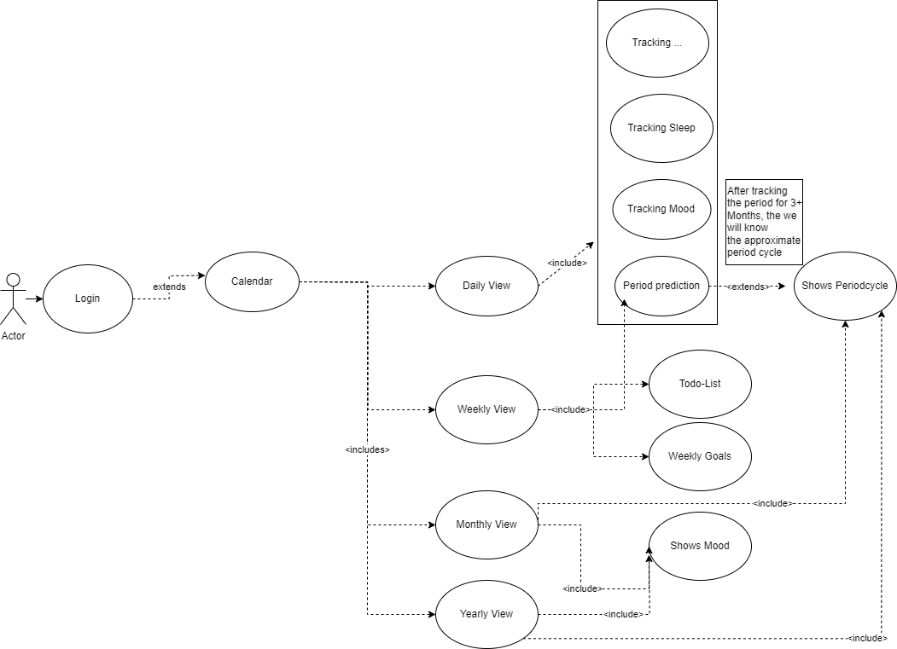
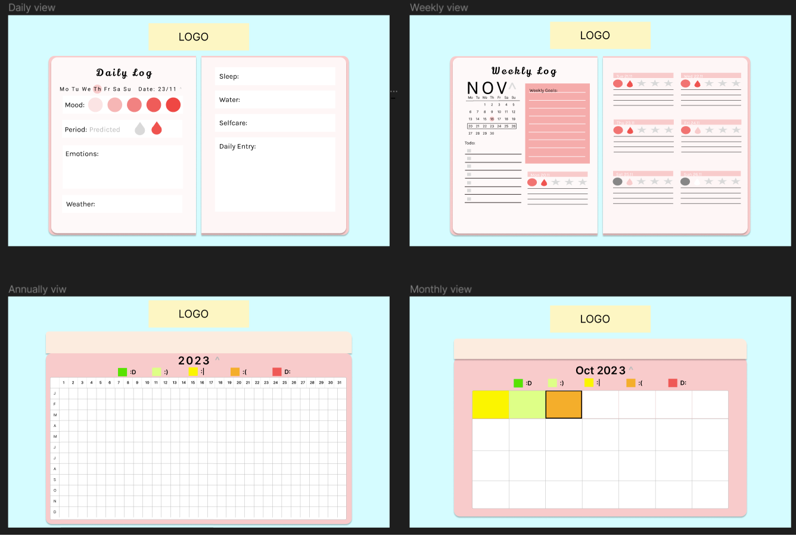
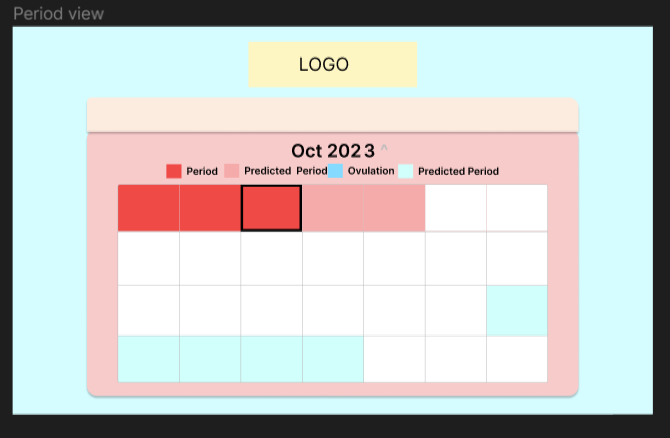

# Pflichtenheft MIOW 

## Inhaltsverzeichnis

- [Pflichtenheft MIOW
diesen usecase werden wir geimeinsam implementiren
zu* zuerst die gui und den generellen aufbau der webseite
* dann die funktionen dass man hizwischen verscden verschiddenen viws wehchseln kann
* dann dass man die sachen eintragen kann
* un d zu gut derlettzt der ie speicherung und die implementation einen s account systemsx
<>img sr c= c = " usecase01-gui.png"
() logo ist in arbeit](#pflichtenheft-miow)
  - [Inhaltsverzeichnis](#inhaltsverzeichnis)
  - [1. Ausgangslage](#1-ausgangslage)
    - [1.1. Ist-Situation](#11-ist-situation)
    - [1.2. Verbesserungspotenziale](#12-verbesserungspotenziale)
  - [2. Zielsetzung](#2-zielsetzung)
  - [3. Funktionale Anforderungen](#3-funktionale-anforderungen)
    - [3.1. Use Case Überblick](#31-use-case-überblick)
    - [3.2. Use Case A](#32-use-case-a)
      - [3.2.1 GUI-Design](#321-gui-design)
      - [3.2.2 Workflow](#322-workflow)
    - [3.3 Use Case B](#33-use-case-b)
      - [3.3.1 GUI Design](#331-gui-design)
      - [3.3.2 Workflow](#332-workflow)
  - [4. Nicht-funktionale Anforderungen](#4-nicht-funktionale-anforderungen)
    - [`Usability`: Benutzbarkeitsanforderung](#usability-benutzbarkeitsanforderung)
    - [`Efficiency`: Effizienzanforderung](#efficiency-effizienzanforderung)
    - [`Maintenance`: Wartbarkeits- und Portierbarkeitsanforderung](#maintenance-wartbarkeits--und-portierbarkeitsanforderung)
    - [`Security`: Sicherheitsanforderung](#security-sicherheitsanforderung)
    - [`Legal`: Gesetzliche Anforderung](#legal-gesetzliche-anforderung)
  - [5. Mengengerüst](#5-mengengerüst)
  - [6. Systemarchitektur](#6-systemarchitektur)
    - [6.1 Deployment-Diagramm](#61-deployment-diagramm)
    - [6.2 Datenmodell](#62-datenmodell)

## 1. Ausgangslage

### 1.1. Ist-Situation

Die heutige Gesellschaft wird von einer rasanten Lebensweise geprägt, weswegen viele Mitmenschen mit ihren Gedanken, Gefühlen und Erlebnissen überfordert sind und diese auch irgendwo sicher aufschreiben wollen. Journaling ist ein riesen Trend geworden, jedoch alle Ereignisse nur mit Stift und Papier aufzuzeichnen ist für viele herausfordernd. Es gibt noch kein Online tool, womit man einfach, effizient und ohne großen Aufwand sein Leben dokumentieren kann, außerdem bieten vorhandene Tools keine Möglichkeit diese schön und ästhetisch zu gestalten. Weiters braucht man viele verschiedene Applikationen, Kalender und Notitzblöcke um wichtige Termine und Ereignisse zu dokumentieren. Ein gutes Beispiel wäre ein Periodentracker, den viele Frauen heutzutage brauchen/verwenden, da der standard Kalender diese Funktion nicht besitzt.

### 1.2. Verbesserungspotenziale

Es besteht Bedarf an einem Online-Tool, das nicht nur die Funktion des Dokumentierens erfüllt, sondern auch ästhetische Möglichkeiten bietet, um die persönlichen Aufzeichnungen ansprechend zu gestalten. Ein All-in-One-Tool könnte beispielsweise einen Periodentracker sowie andere spezifische Funktionen integrieren, um den Anforderungen der Nutzer gerecht zu werden.

## 2. Zielsetzung

Unser Ziel ist es, eine umfassende Online-Plattform mit dem Namen "MIOW"(Mood Insighting & Organizing Webapp) zu entwickeln, die es den Benutzern ermöglicht, ein digitales Tagebuch zu führen um ihre Stimmungen, Emotionen und Aktivitäten festzuhalten und den Personen die ihre Periode haben, es zu ermöglichen ihre Periode einzutragen, verfolgen und zu vorhersagen. Wir wollen mit MIOW folgende Kernfunktionen bieten:

## 3. Funktionale Anforderungen
### 3.1. Use Case Überblick

Der Usecase 1 betrifft jeden benutzer, der usecase 2, wo die Menstruationszyklusdaten erfasst werden nur diejenigern die es in den einstelllungen enabled haben.

### 3.2. Use Case A
Möglichkeit, tägliche Einträge zu verfassen, Stimmungen auszuwählen und Aktivitäten hinzuzufügen. Anpassbare Einträge für persönliche Vorlieben und Bedürfnisse. Dies soll anhand Anpassbaren "Blöcken" passieren, wo man bestimmte "Icons"(zum beispiel happy oder stressed), jeden tag auswählen kann, wenn diese zutreffen. Diese Blöcke soll man personalisieren können, (welche überschrift welche icons etc). Es soll feste definierte blöcke geben wie mood(1-5) oder stimmung(happy etc) oder einen täglichen text.Daraus entsteht eine art Blockset, das jeden tag neu ausgefüllt werden kann und man in Verschiedenen views(anualy, monthly, weekly daily) sehen soll.
Anually: man soll die mood sehen in farben(year in pixels).
Monthly: jeden monat soll man von jeden tag auch wieder die mood sehen, aber nicht in pixeln, sondern in bestimmten styles(zb im oktober Pumpkins oder weihnachten Weihnachtskugeln etc)
weekly: kurze zusammenfassung, der tage die schon eingetragen wurden sind.(normale kalenderansicht)
daily: man sieht alle blöcke, des tages
#### 3.2.1 GUI-Design

( logo ist in arbeit)

#### 3.2.2 Workflow
diesen usecase werden wir gemeinsam implementiren
* zuerst die gui und den generellen aufbau der webseite
* dann die funktionen dass man zwischen den verschiddenen viws wechseln kann
* dann dass man die sachen eintragen kann
* und zu gut derletzt die speicherung und die implementation eines account systems

### 3.3 Use Case B
Der usecase ist wie gesagt nur für diejenigen die es enabled haben, hier hat man eine übericht darüber wann man eingegen hat wenn man seine periode hat und wann es vorgesagt wird dass man ovulated. die eingabe passiert beim täglichen eintragen und hier kann man nur schauen.
#### 3.3.1 GUI Design

#### 3.3.2 Workflow
den usecase übernimmt Lina zunehmend
* zuerst werde ich mich genau darüber informiren wie man alles ausrechnet
* danach werde ich die gui implmentiren
* und schauen dass man zwischen monaten wechseln kann
* danach werde ich implementiren dass die jeweiligen tage angezeigt werden

## 4. Nicht-funktionale Anforderungen
### `Usability`: Benutzbarkeitsanforderung
### `Efficiency`: Effizienzanforderung
### `Maintenance`: Wartbarkeits- und Portierbarkeitsanforderung
### `Security`: Sicherheitsanforderung
### `Legal`: Gesetzliche Anforderung
## 5. Mengengerüst
## 6. Systemarchitektur
### 6.1 Deployment-Diagramm
### 6.2 Datenmodell