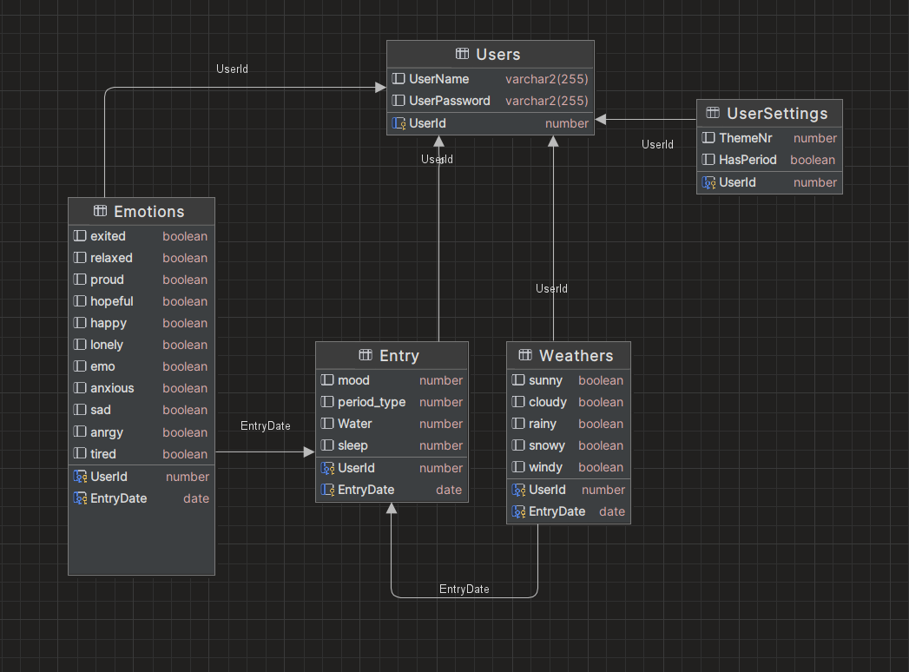

# 

## Inhaltsverzeichnis
- [Pflichtenheft MIOW](#img-srcpflichtenheftheaders1pflichtenheftpng-stylewidth-100)
  - [Inhaltsverzeichnis](#inhaltsverzeichnis)
  - [1. Ausgangslage](#img-srcpflichtenheftheadersausgangslagepng-stylewidth-100)
    - [1.1. Ist-Situation](#11-ist-situation)
    - [1.2. Verbesserungspotenziale](#12-verbesserungspotenziale)
  - [2. Zielsetzung](#img-srcpflichtenheftheaderszielpng-stylewidth-100)
  - [3. Funktionale Anforderungen](#img-srcpflichtenheftheadersfunktionalespng-stylewidth-100)
    - [3.1. Use Case Überblick](#31-use-case-überblick)
    - [3.2 Use Case A - Login](#32-use-case-a---login)
    - [3.3 Use Case B - Tägliche einträge](#33-use-case-b---tägliche-einträge)
    - [3.4 Use Case C - Auswerten der Einträge](#34-use-case-c---auswerten-der-einträge)
    - [3.5 Use Case D - Vorhersagen der Periode](#35-use-case-d---vorhersagen-der-periode)
    - [3.6  Use Case E - Settings](#36--use-case-e---settings)
  - [4. Nicht-funktionale Anforderungen](#img-srcpflichtenheftheadersnfuntionalespng-stylewidth-100)
    - [`Usability`: Benutzbarkeitsanforderung](#usability-benutzbarkeitsanforderung)
    - [`Security`: Sicherheitsanforderung](#security-sicherheitsanforderung)
    - [`Legal`: Gesetzliche Anforderung](#legal-gesetzliche-anforderung)
  - [5. Mengengerüst](#img-srcpflichtenheftheadersmengengerüstpng-stylewidth-100)
  - [6. Systemarchitektur](#img-srcpflichtenheftheaderssystemapng-stylewidth-100)
    - [6.1 Deployment-Diagramm](#61-deployment-diagramm)
    - [6.2 Datenmodell](#62-datenmodell)

# 

### 1.1. Ist-Situation

Die heutige Gesellschaft wird von einer rasanten 
Lebensweise geprägt, weswegen viele Mitmenschen mit ihren Gedanken, Gefühlen und Erlebnissen überfordert sind und
diese auch irgendwo sicher aufschreiben wollen. Journaling ist ein großer Trend geworden, jedoch alle 
Ereignisse nur mit Stift und Papier aufzuzeichnen ist für viele herausfordernd. Es gibt noch kein Online-Tool, womit 
man einfach, effizient und ohne großen Aufwand sein Leben dokumentieren kann, außerdem bieten vorhandene Tools keine Möglichkeit, diese schön
und ästhetisch zu gestalten. Weiters braucht man viele verschiedene Applikationen, Kalender und Notizblöcke, um wichtige Termine und
Ereignisse zu dokumentieren. Ein gutes Beispiel wäre ein Periodentracker, den viele Frauen heutzutage brauchen/verwenden, 
da der Standardkalender diese Funktion
nicht besitzt.

### 1.2. Verbesserungspotenziale

Es besteht Bedarf an einem Online-Tool, das nicht nur die Funktion des Dokumentierens erfüllt, sondern auch ästhetische Möglichkeiten bietet, um die persönlichen Aufzeichnungen ansprechend zu gestalten. Ein All-in-One-Tool könnte beispielsweise einen Periodentracker sowie andere spezifische Funktionen integrieren, um den Anforderungen der Nutzer gerecht zu werden.

# 

Unser Ziel ist es, eine umfassende Online-Plattform mit dem Namen "MIOW"
(Mood Insighting & Organizing Webapp) zu entwickeln, die es den Benutzern ermöglicht, ein digitales
Tagebuch zu führen, um ihre Stimmungen, Emotionen und Aktivitäten festzuhalten und den Personen die, ihre Periode 
haben, es zu ermöglichen ihre Periode einzutragen, verfolgen und zu vorhersagen. Wir wollen mit MIOW folgende
Kernfunktionen bieten:

# 

### 3.1. Use Case Überblick

der benutzer hat die usecases

 * A) Login
 * B)Tägliche Einträge machen
 ->hier hat man ein Fenster, welches man an einem Tag seine Stimmung, einen Text, Perioden-Daten und weitere personalisierbaren Faktoren eingeben kann
 * C)Auswerten des Tagebuches
-> hier sieht man pro Woche und Monat, wie die Stimmung verläuft in einem Kalender-View
 * D)Nächste Periode vorhersagen
  -> hier sieht man in einem monatlichen Kalender die Perdioden-Daten 
* E) Settings

### 3.2 Use Case A - Login
Anmelden und Registrieren
#### 3.2.1 GUI-Design

hier kann man zwischen den fenstern login und create a new account wechseln und das jeweils machen.

#### 3.2.2 Workflow

Workflow mit ACD:

### 3.3 Use Case B - Tägliche einträge
Möglichkeit, tägliche Einträge zu verfassen, Stimmungen auszuwählen und Aktivitäten hinzuzufügen. 
Anpassbare Einträge für persönliche Vorlieben und Bedürfnisse(Usecase Settings). 
Es soll feste definierte blöcke wie Mood(1-5), Stimmung(happy etc) und einen täglichen Text geben. Aber auch definierbare Templates. Daraus ensteht eine Art Blockset, die man danm jeden Tag ausfüllen kann.
Man kann mit Pfeiltasten zurück/nach vorne gehen. Einträge kann man in der Vergangenheit/Gegenwart machen.
#### 3.3.1 GUI-Design

Hier hat man an einem Tag einen "Blockset"(kann man in den Einstellungen festlegen, wird später erklärt).
die fertigen Böcke sind Mood, Daily-Entry und Period(Settings).

den Rest kann man in den Einsetllungen personalisieren.

#### 3.3.2 Workflow
Man wählt den richtigen Tag aus, trägt alles ein und es wird automatisch gespeichert

### 3.4 Use Case C - Auswerten der Einträge
Man hat verschiedene Ansichtten, wo man jeweils den Fortschritt seiner Einträge sieht:
* Monatlich: Jeden Monat soll man von jedem Tag auch wieder die Stimmung sehen. 
* Wöchentlich: Eine kurze Zusammenfassung, der Tage, die schon eingetragen worden sind.(normale Kalenderansicht ) 
  ->in dieser Ansicht kann man auch seine wöchentlichen Ziele notieren.
#### 3.4.1 GUI -Design

#### 3.4.2 Workflow
Workflow mit ACD:

### 3.5 Use Case D - Vorhersagen der Periode
Der Usecase ist wie gesagt, nur für diejenigen, die es berechtigt habe. Hier hat man eine Übersicht darüber, wenn man seine Periode hat. Die Eingabe passiert beim täglichen Eintragen und man kann sich das nur ansehen.
#### 3.5.1 GUI Design
Wie in Usecase C - die Umrandung zeigt den Status an. 
Hier hat man einen monatlichen kalender, wo der Status des Menstruations-Zyklus dargestellt wird.

#### 3.5.2 Workflow
ACD:

### 3.6  Use Case E - Settings
Hier stellt man die verschiedensten Sachen ein:
* Account Settings
  * Abmelden
  * Passwort löschen
  * Daten löschen
* Appearance
  * Wir haben 6 Themen zwischen denen man wechseln kann
* Daily Log Settings
  * hier kann man festlegen was jeden tag eingetragen werden kann
  * das passiert in "blöcken" also eine gruppe an "habbits" (ein Habbit besteht aus einem Icon und einem Namen und man kann ein Habbit an einem Tag entweder auswählen oder nicht)
  * hier gibt es vorgefertigte blöcke, die man selber noch konfigurieren kann
  * und man kann selber blöcke definieren, und habbits
  * hier gibt es die fixen blöcke Mood Period und daily log, wenn man Period oder daily log nicht haben will, kann man
  * die blöcke mit den drei strichen nach unten in den bereich "not shown" zihen
  * die icons werden von uns noch gemacht.

* Privacy and Security
* About us
  * hier wird erklärt, wieso wir an diesem Projekt arbeiten.
#### 3.6.1 GUI-Design
hier sieht man das auswählen der themes

heir sieht man das konfigurieren des Blocksets

hier sieht man das editen des blocksets

hier sieht man welche vorgefertigten blöcke es gibt(nur zum sehen.)

#### 3.6.2 Workflow

Workflow mit ACD:

# 
### `Usability`: Benutzbarkeitsanforderung
- Die Benutzeroberfläche von MIOW wird intuitiv gestaltet sein, um eine angenehme Benutzererfahrung zu gewährleisten.
- Die Anwendung sollte einfach zu navigieren sein, sodass Benutzer ihre täglichen Einträge mühelos verfassen können.
- Die Ästhetik der Anwendung sollte ansprechend sein und die Benutzer dazu ermutigen, regelmäßig Tagebucheinträge zu machen.
- Die Personalisierungsoptionen sollten umfangreich sein, um den individuellen Vorlieben der Benutzer gerecht zu werden.

Dies wollen wir mithilfe von rückmeldungen von Testpersonen machen.

### `Security`: Sicherheitsanforderung
- MIOW muss robuste Sicherheitsmaßnahmen implementieren, um die Vertraulichkeit und Integrität der Benutzerdaten zu gewährleisten.
- Es sollten geeignete Verschlüsselungstechniken verwendet werden, um sensible Informationen zu schützen, insbesondere im Zusammenhang mit sensiblen Daten.
- Zugriffskontrollen sollten implementiert werden, um sicherzustellen, dass nur autorisierte Benutzer auf die Funktionen zugreifen können.
### `Legal`: Gesetzliche Anforderung
- MIOW muss die Datenschutzbestimmungen, insbesondere die Datenschutz-Grundverordnung (DSGVO) und das Datenschutzgesetz (DSG), vollständig einhalten.
- Die Anwendung sollte transparent sein bezüglich der Datenspeicherung und -verarbeitung und die Zustimmung der Benutzer zur Erfassung ihrer persönlichen Daten einholen, gemäß den Anforderungen der DSGVO.
- Es werden Mechanismen vorhanden sein, um Benutzerdaten sicher zu löschen, falls sie dies wünschen oder im Einklang mit geltenden Datenschutzgesetzen erforderlich ist.
- Es werden Tearms of Service und eine Privacy Policy eingeführt, die man mit dem signing up akzeptiert.

# 
### Wieviele User werden erwartet?
Da das Projekt darauf abzielt, eine umfassende Online-Plattform anzubieten, könnte man davon ausgehen, dass eine beträchtliche Anzahl von Benutzern erwartet wird. Vorerst schätzen wir diese auf ca. 400-550 Personen.
### Datenmenge pro Benutzer:
Pro Benutzer könnten wir folgende Daten erwarten:
* Tägliche Einträge: Annahme von durchschnittlich 2 KB pro Eintrag.
* Einstellungen: Annahme von durchschnittlich 50 KB pro Benutzer.

Somit ergibt sich eine geschätzte Datenmenge von etwa 1 MB pro Benutzer pro Jahr.
### Anfrage-Frequenz: 
Wir können annehmen, dass user 1x pro tag auf die Plattform zugreifen.

# 

### 6.1 Deployment-Diagramm

### 6.2 Datenmodell
